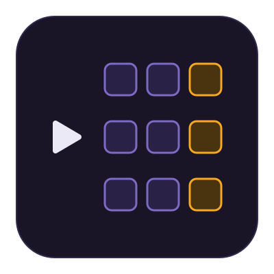

<p align="center"></p>

<h1 align="center">Learning Animated</h1>
<div align="center">
  <!-- PolyForm Noncommercial License -->
  <a href="./LICENSE">
    
  </a>
  <!-- CC License -->
  <a href="./LICENSE-CC-BY-NC">
    
  </a>
  <!-- Version -->
  <a href="https://github.com/josimar-silva/learning-animated/releases">
    
  </a>
  <!-- OSSF Score Card -->
  <a href="https://scorecard.dev/viewer/?uri=github.com/josimar-silva/learning-animated">
    
  </a>
  <!-- CodeQL Advanced -->
  <a href="https://github.com/josimar-silva/learning-animated/actions/workflows/codeql.yaml">
    
  </a>
  <!-- CI -->
  <a href="https://github.com/josimar-silva/learning-animated/actions/workflows/ci.yaml">
    
  </a>
</div>
<div align="center">
  <strong>Animated learning sites, one per track</strong>
</div>

<div align="center">
  Visualize Kafka, Quarkus, Java, and more, one looping SVG at a time.
</div>

<div align="center">
  <sub>Built with <i>viele</i> ☕️ by
  <a href="https://josimar-silva.com">Josimar Silva</a>.
</div>

## 📖 Table of Contents

- [📝 Introduction](#-introduction)
- [🌐 Sites](#-sites)
- [🏁 Getting Started](#-getting-started)
- [🛠️ Available Recipes](#️-available-recipes)
- [🧠 How It Works](#-how-it-works)
- [🧪 Testing](#-testing)
- [🗂️ Project Layout](#️-project-layout)
- [🎨 Design](#-design)
- [🤝 Contributing](#-contributing)
- [📄 License](#-license)

## 📝 Introduction

Learning Animated is a family of animated learning sites, one per track, plus a home page at learning-animated.com. The first tracks are Kafka (an unofficial companion to the book _Kafka: The Definitive Guide_), Quarkus, and Java, and more can follow.

Every lesson is a looping SVG animated with SMIL, and blog posts, talks, and pull requests embed that same file.

## 🌐 Sites

Every track gets its own site on a subdomain of learning-animated.com, and the home page sits at the root.

| Site    | Domain                        | Status                                                                                                  |
| ------- | ----------------------------- | ------------------------------------------------------------------------------------------------------- |
| Home    | learning-animated.com         | Not launched                                                                                            |
| Kafka   | kafka.learning-animated.com   | Live at [kafka-animated.josimar-silva.com](https://kafka-animated.josimar-silva.com/) until the cutover |
| Quarkus | quarkus.learning-animated.com | Not launched                                                                                            |
| Java    | java.learning-animated.com    | Not launched                                                                                            |

## 🏁 Getting Started

Requires [Node.js](https://nodejs.org/) 24+ and [just](https://just.systems/).

```bash
just install  # install dependencies
just test     # run every test suite
just check    # lint, check formatting, and type-check
```

## 🛠️ Available Recipes

This project uses `just` as its command runner. The npm scripts in `package.json` (`npm test`, `npm run lint`, `npm run format`, and `npm run format:check`) cover a subset of the recipes if you prefer npm.

- `just`: Lists every recipe.
- `just install`: Installs dependencies.
- `just ci`: Installs dependencies exactly as locked, as CI does.
- `just test`: Runs every test suite once with Vitest.
- `just lint`: Lints the code with ESLint.
- `just format`: Applies ESLint fixes, then formats with Prettier.
- `just check`: Runs ESLint, the Prettier check, the TypeScript type-check for the root and each package, and `just style-check`.
- `just style`: Re-embeds the canonical `LA-STYLE` block into every animation SVG under `tracks/*/src/content/animations`.
- `just style-check`: Fails if the `LA-STYLE` block in any of those SVGs has drifted from `theme.css`.
- `just clean`: Removes coverage reports and build output.
- `just pre-commit`: Runs `just check` and `just test`, to use before committing.

## 🧠 How It Works

- **One theme.** [`packages/design/theme.css`](packages/design/theme.css) is the single source for every color, font, and size. Tailwind reads it for the site chrome, and the `LA-STYLE` generator reads its first `@theme` block, the stage, for the SVGs.
- **One style block per SVG.** Every animation SVG embeds the same generated `<style>` block between `/* LA-STYLE:START */` and `/* LA-STYLE:END */`. It declares the stage variables, a `fill-` and a `stroke-` utility for every palette color, the type and fixed utilities, and the `la-*` components. Never edit it by hand: change `theme.css`, then run `just style` to re-embed it everywhere. `just check` runs `just style-check`, which fails when a block has drifted.
- **The SVG contract.** [`packages/svg-kit`](packages/svg-kit) exports `assertSvgContract`, the rules every animation SVG must pass. [🧪 Testing](#-testing) lists them.
- **Timeline helpers.** `timeline.ts` reads a SMIL timeline as a function of loop time, so a test can ask what an element shows at any moment.
- **Author helpers.** `author.ts` writes the timelines of generated SVGs: `show` turns intervals into a discrete opacity timeline, `move` turns waypoints into a translate animation, and `escapeXml` escapes text for markup.
- **Contrast math.** `contrast.ts` computes WCAG relative luminance and contrast ratios, which the palette contrast test uses.

## 🧪 Testing

Tests are written first and must fail before the code exists. `just test` runs [Vitest](https://vitest.dev/) once across the projects in [`vitest.config.ts`](vitest.config.ts): one per package (`design` and `svg-kit`), with tests next to the code they cover, and `repo` for the repository-wide checks in [`test/repo`](test/repo). CI runs `just check` and `just test` on every pull request and every push to `main`.

`assertSvgContract` in [`packages/svg-kit/src/contract.ts`](packages/svg-kit/src/contract.ts) is the contract for every animation SVG, and `contract.test.ts` pins each rule. A passing SVG:

- Parses to an `<svg>` root with the SVG namespace and a four-number `viewBox`.
- Is accessible: `role="img"`, a non-empty `<title>`, and a non-empty `<desc>`.
- Embeds the canonical `LA-STYLE` block verbatim.
- Keeps all CSS inside that block, with no other rules and no `style` attributes.
- Uses no raw colors (hex, `rgb()`, or `hsl()`) in color properties.
- Paints at full strength, with no `fill-opacity` or `stroke-opacity`.
- Animates with SMIL only: at least one SMIL element, no `@keyframes`, and no CSS `animation`.
- Has well-formed `keyTimes`: numeric, starting at 0, never decreasing, within 0 to 1, ending at 1 unless the timeline is discrete, and one per value.
- May set `data-loop="<seconds>s"` on the root. If it does, that value equals the `dur` of the story's own animations, and no animation runs longer.

[`test/repo/palette-contrast.test.ts`](test/repo/palette-contrast.test.ts) holds the palette in `theme.css` to WCAG AA. Text pairs, such as offsets on cells and labels on actor fills, reach 4.5:1, and graphical marks, such as cell outlines, arrows, and markers, reach 3:1. The test measures each pair at full strength, which is why the contract bans `fill-opacity` and `stroke-opacity`.

[`test/repo/conventions.test.ts`](test/repo/conventions.test.ts) checks the repository itself: the justfile defines the standard recipes, every external dependency is pinned to an exact version, `@types/node` follows the Node major in `.nvmrc`, no text file contains an em dash or an en dash, and the shared meta and config files exist. [`test/repo/workflows.test.ts`](test/repo/workflows.test.ts) checks that the CI, CodeQL, and Scorecard workflows exist, that every action is pinned to a full commit SHA with a version comment, that every job hardens the runner first, and that every workflow declares its permissions at the top level.

## 🗂️ Project Layout

```
justfile                        task runner (just ci, check, test, format, style)
vitest.config.ts                the Vitest projects: every package plus test/repo
docs/images/logo.svg            the project mark, drawn from the stage palette
packages/design/theme.css       every color, font, and size (single source of truth)
packages/design/signature.md    the aesthetic signature, in prose
packages/design/fonts/          Inter, self-hosted, with its license
packages/design/src/            theme parser, LA-STYLE generator, and sync
packages/design/bin/la-style.ts the sync CLI behind just style and just style-check
packages/svg-kit/src/           parse, contract, timeline, author, and contrast helpers
test/repo/                      conventions, workflows, and palette contrast tests
.github/workflows/              CI, CodeQL, and Scorecard
```

## 🎨 Design

We keep the code and the diagrams simple and honest: small pieces that do one thing, tests that describe behavior first, and no accidental complexity. The signature gives every animation the same look: a near-black plum stage, purple for whatever is stored, one amber accent for what is new, and one red for failure. The full aesthetic signature (principles, palette, utilities, components, role recipes, and accessibility) lives in [`packages/design/signature.md`](packages/design/signature.md).

## 🤝 Contributing

Contributions are welcome. Please read the [Contributing Guidelines](CONTRIBUTING.md) and the [Code of Conduct](CODE_OF_CONDUCT.md) before opening a pull request.

## 📄 License

Copyright (C) 2026 Josimar Silva

Unless otherwise specified:

- **Content:** The lessons, with their animations and text, and the artwork, such as the logo, are licensed under the [Creative Commons Attribution-NonCommercial 4.0 International (CC BY-NC 4.0) License](LICENSE-CC-BY-NC).
- **Source code:** Everything else is licensed under the [PolyForm Noncommercial License 1.0.0](LICENSE).

Neither license allows commercial use. The grants cover this project's own work only, not the book _Kafka: The Definitive Guide_, its figures, or any trademark named in [tracks/kafka/ATTRIBUTION.md](tracks/kafka/ATTRIBUTION.md). Third-party files keep their own licenses, such as the Inter font under the SIL Open Font License 1.1.
